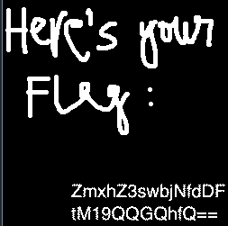

README

# Perfect Secrecy
50 pts

Alice sent over a couple of images with sensitive information to Bob, encrypted with a pre-shared key. It is the most secure encryption scheme, theoretically...

[image1](image1.png)

[image2](image2.png)

## Flag:
```shell
flag{0n3_t1m3_P@d!}
```

## Solution
Download two images. Using stegsolve.jar (https://github.com/eugenekolo/sec-tools)
open one of the images and choose  "Analyse" -> "Image Combiner"



ZmxhZ3swbjNfdDFtM19QQGQhfQ==

Decode using base64.
