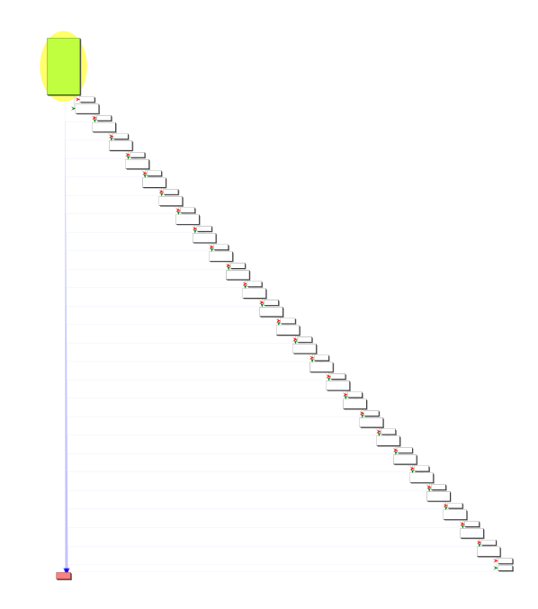

README

# ezbreezy
100 pts

This binary has nothing to hide!

[app]

## Flag:
```flag
flag{u_h4v3_r3c0v3r3d_m3}
```

## Solution
Download binary. Open in Ghidra. It's an ELF, x64. Entry point at 0x00101080. Jumps to 0x001011d8, loads a string into memory. String does not have the flag. Calls another function, 0x00101179 which open a txt file, reads, closes the file and leaves - not even a real file. Back in function 0x001011d8, we clean up and leave. Nothing to see here, move along.

So what else in in the binary? Que function at 0x009001a0. Big compare and jump. Good to look at this in the function graph.


At the end of this, it just sets EAX to 0 and leaves. So lets look at what's its doing
Two ways to handle this - either walk out the logic, or force the jump and see what happens. Ended up just hand-jamming values, wasn't that bad. There are three values, a move to stack and two compared values. Just looking at the stack values:
```shell
8e 94 89 8f a3 9d 87 90 5c 9e 5b 87 9a 5b 8b 58 9e 5b 9a 5b 8c 87 95 5b a5 
```

And that's when I got lost. This was gibberish. Turns out, from here the solution is to subtract 0x28 from all values. But why???
