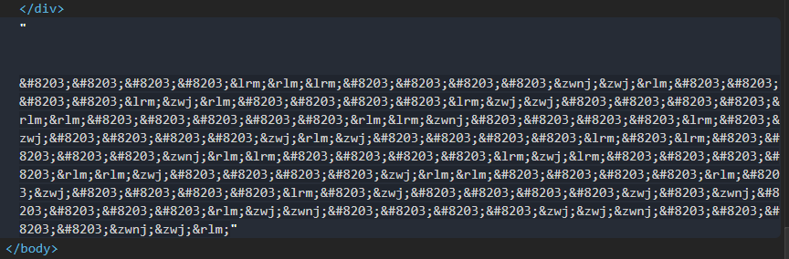

README

# widthless
50 pts
Welcome to web! Let's start off with something kinda funky :)

http://web.chal.csaw.io:5018

## Flag:
```flag
flag{gu3ss_u_f0und_m3}
```

## Solution
If you have ever played http://notpron.org/notpron/ or follow any of @1o57's riddles - you'll find this familiar.

Head to the website and look at source. First hing in the title:
```
<title>Hidden.me</title>
```
Next hint inbetween divs for the form and about
```
<!-- zwsp is fun! -->
```
So zero-width encoding. Next big hint at the bottom of page:


Time for python. Using zwsp_steg module make a request to the page.
```python
import requests as req
import zwsp_steg

addr = 'http://web.chal.csaw.io:5018/'
r = req.get(addr).text
decoded = zwsp_steg.decode(r)
print(decoded)
```

You get a base 64 encoded string. Deal with that
```
import base64
decoded = base64.b64decode(decoded.encode('ascii')).decode('ascii')
print(decoded)
```

Should get
```
alm0st_2_3z
```

Submit that to the form in the webpage: The return is
```
/ahsdiufghawuflkaekdhjfaldshjfvbalerhjwfvblasdnjfbldf/<pwd>
```

Append the "password" and navigate to the resulting page:
```
http://web.chal.csaw.io:5018/ahsdiufghawuflkaekdhjfaldshjfvbalerhjwfvblasdnjfbldf/alm0st_2_3z
```

More zwsp. Use the same python code with the new address
```python
import requests as req
import zwsp_steg

baseURL= 'http://web.chal.csaw.io:5018/ahsdiufghawuflkaekdhjfaldshjfvbalerhjwfvblasdnjfbldf/alm0st_2_3z'
r = req.get(baseURL).text
decoded = zwsp_steg.decode(r)
print(decoded)
```

Produces:
```
5f756e6831645f6d3
```
This is not base64 - looks like hex
```python
print(bytes.fromhex(decoded).decode())
```

Gives:
```
u_unh1d_m3
```

Submit that to the form on the page. It returns the next step:
```
/19s2uirdjsxbh1iwudgxnjxcbwaiquew3gdi/<pwd1>/<pwd2>
```

Use that hint to create the next navigation point
```
http://web.chal.csaw.io:5018/19s2uirdjsxbh1iwudgxnjxcbwaiquew3gdi/alm0st_2_3z/u_unh1d_m3
```

And then you get your flag
