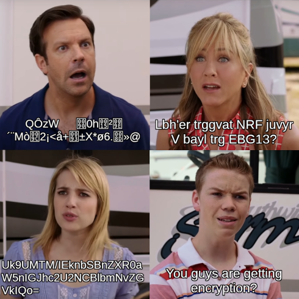
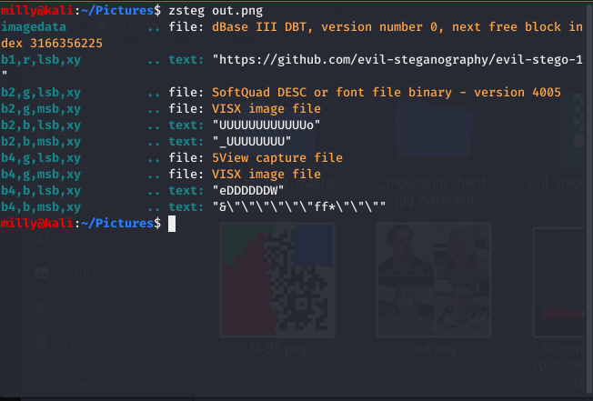
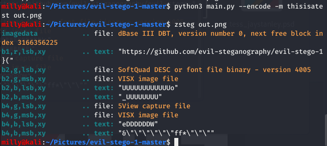

# Evil_Stego
?? points

Provided an image and a link to some code



https://github.com/evil-steganography/evil-stego-1

## Flag:
```shell
flag{4b50lu73ly_b4rb4r1c_1403379d}
```

## Solution
This is one that a team mate started. First thing was to look for strings and LSB



He then ran the provdided program on an image of his own with a message of this own:



He noticed some additional characters in the text provided in (b1,r,lsb,xy). But wasn't sure what to make of it. He posted his inital results to our server, and I started working it.

The first thing in the attached program that correlates to the above results is that the text of interest is from the metadata string.
```python
metadata = b"\x90\xbfhttps://github.com/evil-steganography/evil-stego-1" + bytes(seed) + pack("<I", size)
```

So the characters Milly was seeing had to do with the seed. However, I noted that the seed will change (line 37), so the location of the data and the order of the data will change each run. 
```python
seed = [random.getrandbits(8) for i in range(4)]
```

Tthe metatdata string shows that the link is encoded with 8 additional byes (4 for the seed values, and 4 for the size of the encoded message). The seed is important. Without it, it would be neigh impossible to do the challenge. With the seed values and the message length, we have the keys we need. I used https://gchq.github.io/CyberChef to upload their image, Extract LSB, AND with 0xFF and look at it in hex to get the 4 seed values and the message length. (later, I wrote the code to extract this from the image).

The next idea came from running their code with an image and message of my own, recording the seed values and the locations that it put the bytes (line 52). 
```python
locations = random.sample(valid_spots[c:], size * 8 + 1)
```

From that I was able to write a "bit picker" to pick out the bits where the message was hidden.