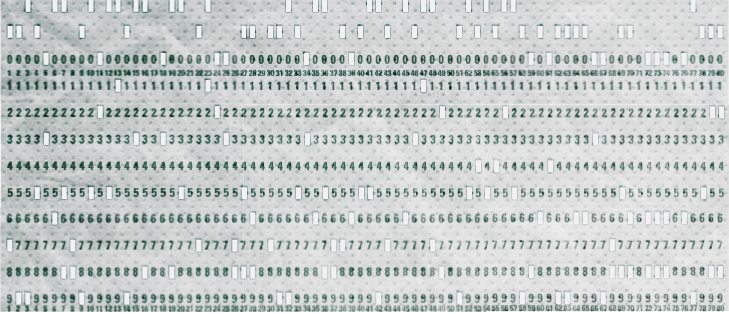
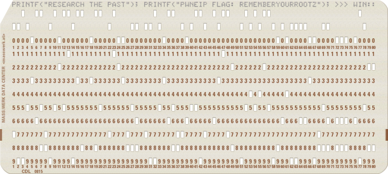

README

# The Past
?? points
Bunch of images to download


## Flag (assumed, ran out of time)
```shell
REMEMBERYOURROOTZ
```

## Solution

Didn't get this one finished until about 10min after the end of the CTF so wasn't able to check the flag. Download 9 images and open in GIMP (https://www.gimp.org/) and arrange. They make a puchcard.



Several sites out there on reading these things. This one (https://www.masswerk.at/keypunch/) was helpful. Made a map using that and started decoding, recording results in Excel:
```shell
1	2	3	4	5	6	7	8	9	10	11	12	13	14	15	16	17	18	19	20	21	22	23	24	25	26	27	28	29	30	31	32	33	34	35	36	37	38	39	40	41	42	43	44	45	46	47	48	49	50	51	52	53	54	55	56	57	58	59	60	61	62	63	64	65	66	67	68	69	70	71	72	73	74	75	76	77	78	79	80
							78																		78											78							null					28																			78			null									
P	R	I	N	T	F	(	"	R	E	S	E	A	R	C	H	space	T	H	E	space	P	A	S	T	"	)	;	space	P	R	I	N	T	F	(	"	P	W	N	E	I	P	space	F	L	A	G	:	space	R	E	M	E	M	B	E	R	Y	O	U	R	R	O	O	T	Z	"	)	;	space	>	>	>	space	w	i	n	:	:

```


