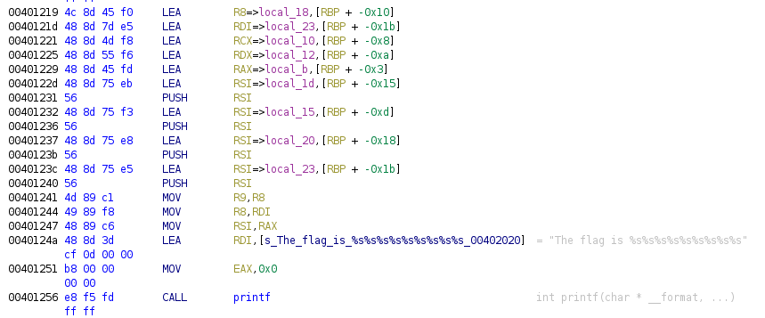
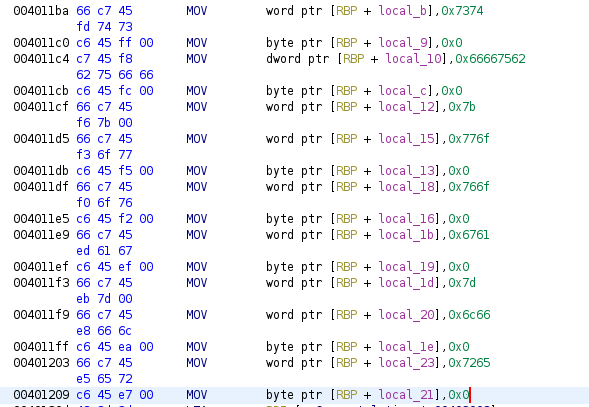
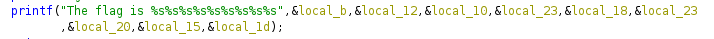

# Clicker
100 pts

All you have to do is score 10,000,000 to get the flag.
Get Clicking!!!!!

## Flag:

```shell
ts{bufferoverflow}
```

## Solution:

Download attachment. In terminal look at what we have.

```shell
kali@kali:~/Desktop/June_gle/pwn$ file clicker 
clicker: ELF 64-bit LSB executable, x86-64, version 1 (SYSV), dynamically linked, interpreter /lib64/ld-linux-x86-64.so.2, BuildID[sha1]=11ac466bcbd78335468cfb7bf47b39c816184399, for GNU/Linux 3.2.0, not stripped
kali@kali:~/Desktop/June_gle/pwn$ strings clicker 
...
Congratulations!
The flag is %s%s%s%s%s%s%s%s%s
clicker_save
...
```

The flag is not in the list of strings, but the one string talks about the flag. Open the program in Ghidra and locate that string. It's at instruction 0x0040124a.



So, the program pushes a bunch a variables to the stack then calls print. Looks like the flag is hard coded. Take a look at the variable allocation:



I can not say I completely understand what's happening on the stack and with printf. My understanding was that printf grabbed parameters from the stack (LIFO), but it looked like registers are being used here as well. Thank you Ghidra for helping me see what's happening:



Remeber that byte order is reversed. The final appearence of the bytes:

```shell
0x74737b6275666665726f766572666c6f777d = ts{bufferoverflow}
```

