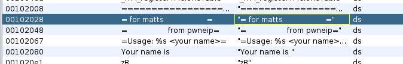
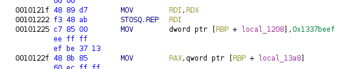

# for Matts
50 points

Is this right? for Matt? Flag format is an 8 character string.

## flag:
```shell
1337beef
```

## solution
Download binary. I went straight to Ghida. Looking for good strings, found these:



Going to the reference for that first one, and reading through the assembly a bit, 0x00101225 stands out:



An 8 character string you say?


