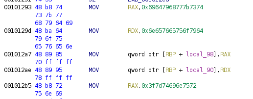

README

# ltrace-easy
100 pints

Can you run the binary?

You may have to trace it or something.

## flag
```shell
ts{whydidyouevenrunit}
```

## solution:
Download binary. file command lets you know it's an ELF file, strings shows nothing interesting. Open in Ghidra. Main starts at 0x001011a5. Some interesting byte arrays are being allocated. Explored those. At 0x0010128e it does a compare loads a byte array into memory and prints it. Remember endiness, and get the flag:



