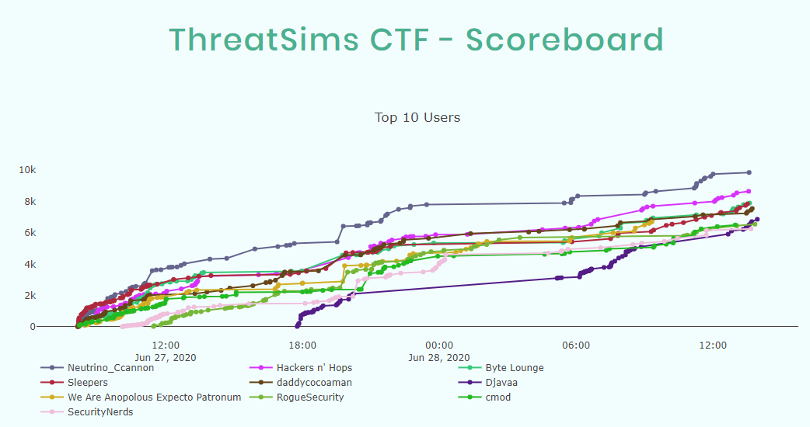
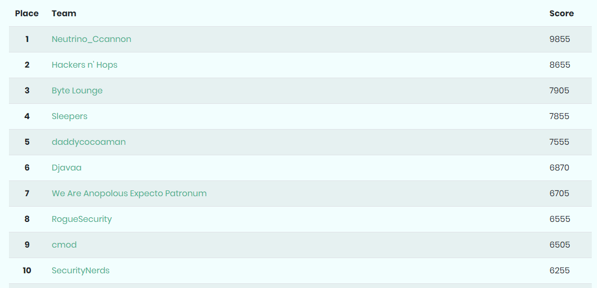
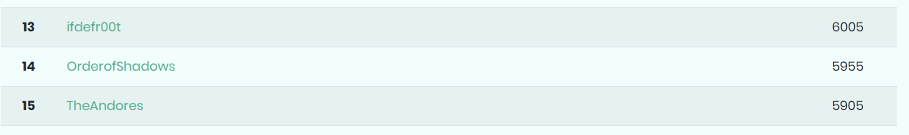

README

OrderofShadows holding their own!

Challenes in the writeup:
- Crypto
	- [Easy](Crypto/Easy/)
	- [Feelz](Crypto/Feelz/)
	- [Network Names](Crypto/NetworkNames/)
	- [TextStego](Crypto/TextStego/)
- Misc
	- [Sudo What?](Misc/SudoWhat/)
	- [The Past](Misc/ThePast/)
- Netwrok
	- [Covert Comms](Netwrok/CovertComms/)
	- [DoS Series (1-1, 1-2, 1-3, 2-1, 2-2, 3-1)](Netwrok/DoS_Series/)
	- [Requests](Netwrok/Requests/)
- Programming
	- [Roll (1,2,3)](Programming/Rolls/)
- Pwn
	- [Clicker](Pwn/Clicker/)
	- [for Matts](Pwn/forMatts/)
	- [Intro](Pwn/Intro/)
	- [ltrace-easy](Pwn/ltrace-easy/)
	- [strings](Pwn/Strings/)
- [Trainer](Trainer/)
