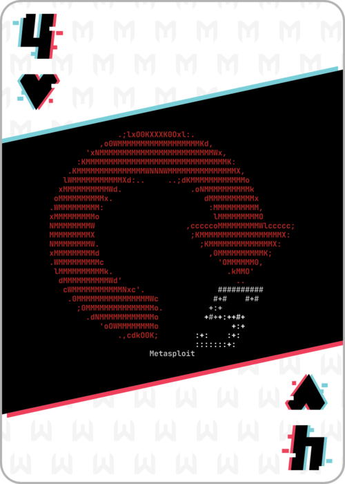

# 4 of Hearts




The 4 of hearts is the first challenge (on port 80). SSH into the provided Kali box to set up a persistent connection to their network. As the box is command line only, I used my host and proxychains to access a browser on this network.

In one terminal, ssh into to provided kali instance:
```
ssh -D 9050 kali@204.236.193.230 -i metasploit_ctf_kali_ssh_key.pem
```

In another terminal, launch a proxychain firefox
```
proxychains firefox 172.15.41.117
```

The 4_of_hearts.png is on the webpage. Flags are usually going to be in the form md5sum(flag.png). 

## FLAG:
```
776d1d5ecfb91f71aecad71cb3c7c9d1
```