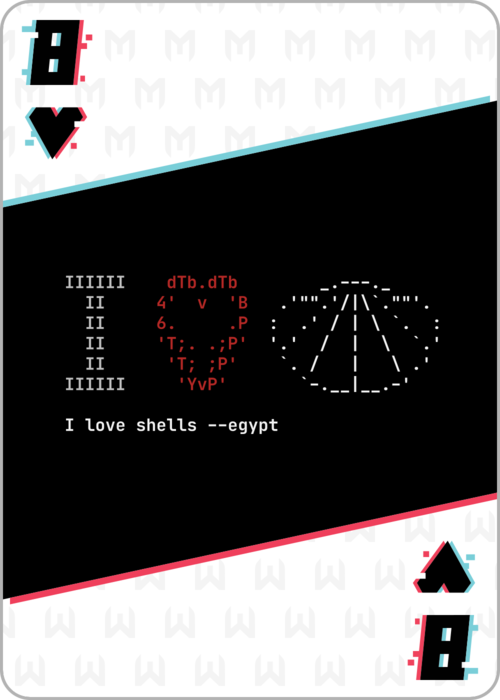
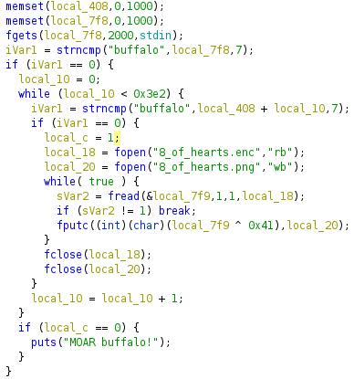

# 8 of Hearts 



Port 4545 has the 8_of_hearts challenge.  After navigating to the website the user is provided a binary file and what I assume is an encoded file containing the flag. Jump into Ghidra.

The main function seems to suggest that the user should enter the phrase "buffalo" at the new line. But, there is another strncmp of "buffalo" with an area in memory that doesn't seem to get set. Is this an impossible jmp? If we pass this jump, the code should decrypt the file to a png. 



Also, looks like the only encryption is a XOR with 0x41. The qwuestion is use a debugger to pass the jump of just write some python?

Tried the debugger route:
* gdb (with pwngdb extention)
* set break at main+194
* set $eax=0

Problem with debugging - it check "buffalo" against a new location in memory every iteration of the inner while loop. That's alot of breaks or very careful allocation of memory. So, ... what's in this memory location - well it should be "buffalo" on repeat - sort of? I tried a few different patterns and decided that writting a little bit of python would be better. 

```python
import subprocess

enc_file = '8_of_hearts.enc'
out_png = '8_of_hearts.png'

with open(enc_file,'rb') as infh:
    with open(out_png,'wb') as outfh:
        byte = infh.read(1)
        while byte != b'':
            xor = int.from_bytes(byte,'big') ^ 0x41
            outfh.write(bytes([xor]))
            byte = infh.read(1)

subprocess.run(["md5sum", out_png])
```

## FLAG:
```
40b13993ed3f7803bba25a086d80defe
```