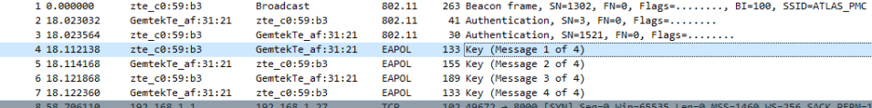
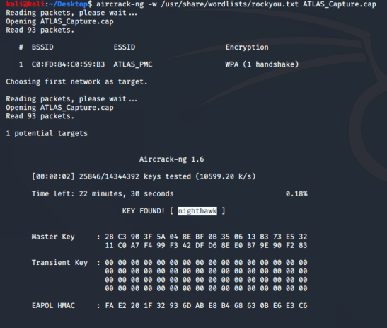

# Peculiar Packet Capture
400 points

Agent,

We have a situation brewing. Last week there was an attack on the prime minister
of Morocco. His motorcade was stopped by a road blockade where heavily armed men
opened fire on them. Fortunately, the prime minister was able to escape safely but
many personnel and a few other ministers did not.

ATLAS, a multi-national Private Military Corporation (PMC) based in Colorado, USA,
is our main suspect. We believe they were hired to conduct the hit by the opposition
political party.

We flew Agent Jason to Colorado to investigate further. He gained access to their
building's reception area dressed in a suit acting as a potential client with an
appointment. He was able to intercept wireless network traffic from their corporate
wireless network before being escorted out by guards when they realised the bluff.

The network capture is attached below, see if you can recover any important documents
which could help us tie ATLAS to the Morocco incident.

(ATLAS_Capture.cap)

## References and Tools
https://www.wireshark.org/
https://www.kali.org/
https://www.aircrack-ng.org/

## Flag
```shell
ractf{j4ck_ry4n}
```

## Solution
Download wireless packet capture file.  Open in Wireshark. 
4-way handshake and keys?



Spin up Kali, use rockyou.txt and aircrack-ng:



Back to Wireshark. Tell it about the key:

Edit->Preferences->Protocols->IEEE802.11 , Decryption keys (Click Edit)

Add a key, type=wpa-pwd, key=nighthawk:ATLAS_PMC (key format pass:SSID). Ok, Ok.
Back in main window, traffic should now be TCP. Right click on any of them, select Follow-> TCP Stream.

Looks like a pdf file.

Back in main window, select File->Export Objects->HTTP

New window shows Financial_Statement.pdf. Save it, open it, get flag

