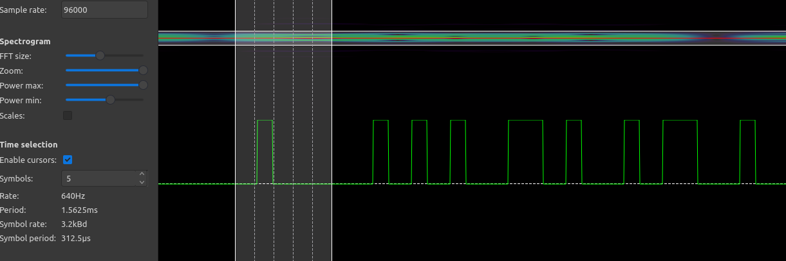

# ASK Challenges

- [ASK Challenges](#ASK-challenges)
  - [Acquire](#acquire)
  - [Playback](#playback)
  - [Decode](#decode)
  - [Flags](#flags)
  - [References](#references)

## Acquire
See [Acquiring the signal](../Acquisition/README.md#Acquisition)

## Playback
See [Playback of signal](../Acquisition/README.md#Playback)

Used Gqrx at first to get a better feel for the signal.

Then used Audacity to do some quick math.

- 8 full pulses, with 1 partial at the beginning.
- pulse look to contain the same data, partial missing the beginning
- 160ms pulse of data, about +/-15,372 samples
- 8ms in between pulses.
- 12 groups within the pulse
- groups seperated by +/- 150 samples, 1.5ms

With that, decided to trim the original file down to a single pulse.

Wrote a python script to help with that.

## Decode

Used a program called Inspectrum to pull out sysmold (0's and 1's). Honestly, not the most satisfying experience.  Depending on the fft size, the max amplitude, the processing envelope, you can get vastly different results.



But finally managed to get a successful read. Had to push the power max option to the highest (far right on the slider).

Once I had setting looking good for the fist group - it took 512 symbols to cover the pulse. Export the symbols to a file.

Wrote a python script to decode the 1's and 0's to ASCII.

Note - I was expecting a start bit and a preamble. Turns out - signal start one bit before the first "on" bit. That was very frustrating. I would have designed this challenge with a start and stop flag.

Note - Heard good things about Universal Radio Hacker - but it seemed just as fiddily. Had trouble with it even reading a file.

## Flags

```text
ASK 1: Is this really the only village you've been to this year?
```

## References

- [https://gnuradio.org/](https://gnuradio.org/)
- [https://www.audacityteam.org/](https://www.audacityteam.org/)
- [https://gqrx.dk/](https://gqrx.dk/)
- [https://github.com/miek/inspectrum](https://github.com/miek/inspectrum)