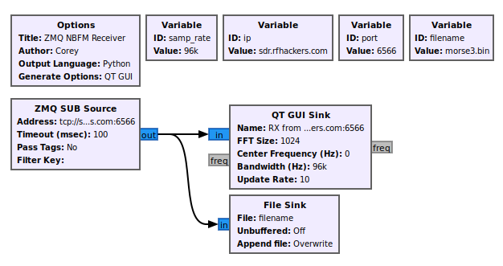
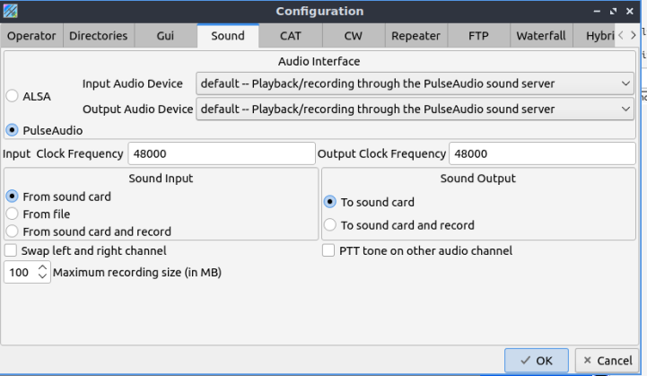
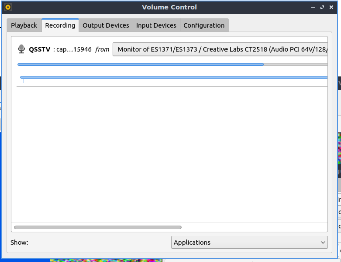
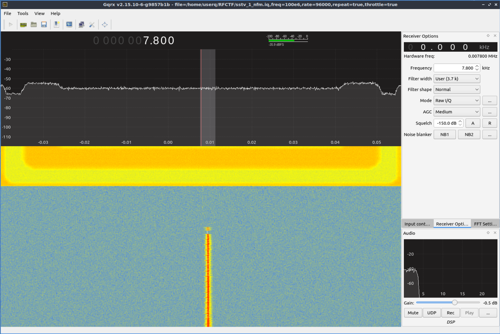

#  Acquisition 
## ZMQ (Remote over TCP/IP)

The kind folks of RFHS provide a few `gnuradio` templates to get participants started. As is, the gr template will use zqm to connect to a server:port combo and show and play the signal. I added a file sink for IQ file creation and removed the filters and audio sink. Audio was not great during live capture due to latency.

You'll want to change the port and filename variables.

[../zmq_to_file.grc](../zmq_to_file.grc)



When starting the template, you will get the signal in real time. The signal will always start with the channel marker from RFHC

# Playback
- Tested on DragonOS_FocalX_R30.2

Validate your default setup is to use PulseAudio, not ALSA



## Method 1: Live playback on default audio device
This will enable programs (Such as QSSTV) to make use of the audio generated by the live `gnuradio` capture, or replay of the IQ file uing `gqrx`.

### Start target program and pulse audio GUI

```
pavucontrol-qt (or pavucontrol)
```


In the "Recording" tab, set your target program to monitor the default audio device (NOT a null-sink/virtual cable)



### Live playback via `gnuradio` capture
Just begin the capture in gnuradio
### Live playback of IQ file using `gqrx`

NOTE: MAKE SURE YOU SET THE SAMPLE RATE TO THE SAME AS THE GRC TEMPLATE. 
- The channel marker RFHC logo should fill the width, and not be distorted

After opening `gqrx` use the following device string for "Complex Sampled (IQ) File": 
```
file=/path/to/something.iq,freq=100e6,rate=96000,repeat=true,throttle=true
```

Breakdown of arguments
- `file=` the path to the IQ file to play
- `freq=` Frequency, in hexadecimal
- `rate=` Sample rate (match this to grc template)
- `repeat=` Should playback repeat?
- `thottle=` ? but it's on most google results

You should see something that starts to look like this


## Method 2: Using a "virtual cable"
This will make a sink in Pulse Audio that you can then play .wav files to. Any program monitoring that sink will get the audio.

### Playing .wav file through virtual sound: 

Modified slightly from instructions here: https://ourcodeworld.com/articles/read/956/how-to-convert-decode-a-slow-scan-television-transmissions-sstv-audio-file-to-images-using-qsstv-in-ubuntu-18-04

### Make a "virtual cable" 
```
pactl load-module module-null-sink sink_name=virtual-cable
```

### Start pulse audio GUI
Start your target program (e.g., QSSTV) and open the pulse audio GUI

```
pavucontrol-qt (or pavucontrol)
```

In the "Recording" tab, set your target program to monitor the sink_name of your virtual-cable

### Play .wav file on the "virtual cable"

```
paplay -d virtual-cable youraudiofile.wav
```


