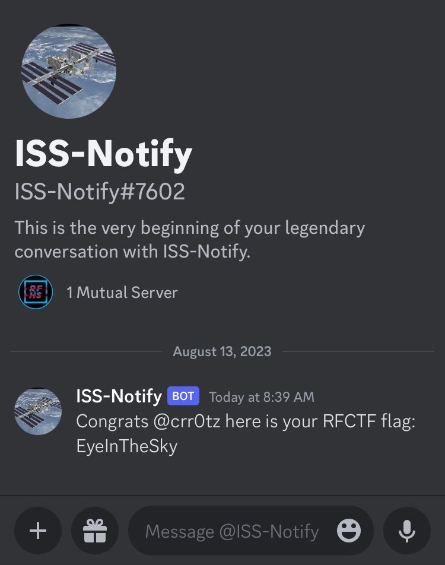
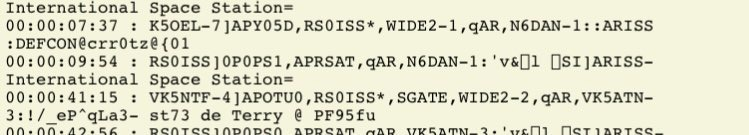

# ISS

This challenge requires a message to be sent to the international space station (ISS), be digipeated back to earth, and reported on ARISS.net

<b>An amateur radio license is required! </b>

The message to the ISS must include the following string to count 

```
DEFCON@discord_username@
```

## Flag



## Solution

### Planning
Figure out when the ISS will have a good pass over your location.

[https://www.n2yo.com](https://www.n2yo.com)

### Radio
Program your radio. We used a Yaesu FT5Dr. Pulled the manual for ARPS from DX Engineering.

[https://static.dxengineering.com/global/images/instructions/ysu-ft-5dr_dz.pdf](https://static.dxengineering.com/global/images/instructions/ysu-ft-5dr_dz.pdf)


* Menu 4 (Modem Setting):
    * 1200 bps
* Menu 7 (ARPS Msg Txt):
    * pick an open slot, type message
* Menu 18 (Digipath): 
    * P4 
        * Address1: ARISS
        * Address2: WIDE2-1

Set preset for freq 145.825Mhz (2m) and set the mode to “Packet” mode.

### Tracker
Set up sat tracker so you can follow the ISS as it passes overhead. We used an app for cell phone.

[https://issdetector.com/](https://issdetector.com/)

### Antenna
We used an Elk Antennas 2M/70cm VHF/UHF Dual-Band Log Periodic Handheld Directional Antenna - 2M/440L5

[https://elkantennas.com/](https://elkantennas.com/)


### Monitoring
Keep an eye on the following site where the message should show up.

[http://ariss.net/](http://ariss.net/)



## Fails
In previous DEFCONs I had tried doing this via a Yaesu FT991A. It does not do packet mode by itself, so I tried setting up software to do it and interact with the radio. We have had success with things like FT8 on WSJT-X, but no luck so far with setting up some of the software listed on blogs and other writeups.

Recently aquired the Yaesu FT5D handheld with has APRS mode built in and it worked like it should the very first attempt.