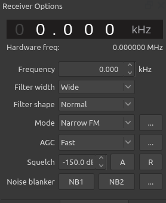

# POCSAG Challenges

>POCSAG (Post Office Code Standardisation Advisory Group), also known as Super-POCSAG, Radio Paging Code No. 1 or RPC1, is a one-way 2FSK paging protocol that supports 512, 1200, and 2400 bps. ([https://www.sigidwiki.com/wiki/POCSAG](https://www.sigidwiki.com/wiki/POCSAG))

>POCSAG pages are transmitted in a batch structure, with a long pre-amble at the beginning of the message to allow pagers to periodically asynchronously wake up, and listen for a page. Once they detect the preamble, they sync-up to the PCSAG message by detecting the embedded synch bits. Pagers analyze sequential batches of pages to see if any batch contains an address code word frame with its own cap code. ... “Cap Code” stands for Channel Access Protocol code, which is the unique ID code assigned to a particular pager. ([https://www.raveon.com/pdfiles/AN142(POCSAG).pdf](https://www.raveon.com/pdfiles/AN142(POCSAG).pdf))

This writeup contains the methods used for the virtual POCSAG challenges.

- [ASK Challenges[README](#POCSAG-challenges)](#POCSAG-challenges)
  - [Acquire](#acquire)
  - [Playback](#playback)
  - [Decode](#decode)
  - [Flags](#flags)
  - [References](#references)

## Acquire
See [Acquiring the signal](../Acquisition/README.md#Acquisition)

## Playback
See [Playback of signal](../Acquisition/README.md#Playback)

I'm sure there is a way to use gnuradio or audacity for this, but I found that the easiest (i.e. most repeatable and less finiky) way to do this was with Gqrx with output going to UDP.

In Gqrx, configure the I/O Device to open the IQ file with sample rate at 96000.


To clean up the capture, I used dd to trim the data down to just the signal of interest.

```bash
((\
skip=20,\
count=5,\
samp_rate=96000,\
num_chan=2,\
size=4,\
block_size=512,\
ddskip=samp_rate*num_chan*size*skip/block_size,\
ddcount=samp_rate*num_chan*size*count/block_size\
));\
dd if=pocsag_msg.bin of=pocsag_msg_trim.bin bs=$block_size skip=$ddskip count=$ddcount
```

The calculations for skip and count are based on the sample rate, number of channels, size of datapoint and number of seconds. The number of channels is considered 2 because IQ files interleve I and Q samples.

```bash
ddskip = samp_rate * num_channels * size * skip) / block_size
       = ( 96000   *      2       *  4   * 24  ) / 512
```

Similiar calculation for count. In this case, I am skipping 20 seconds into the collection and then coping the next 5 seconds of data.

Once you have the file the way you want, stream the data to UDP port 7355.


Make sure to select UDP in the audio settings. May need to enable it in View -> Audio.


Gqrx receiver options setup include selecting NBFM and making sure the signal in inside the filter area.



## Decode

Not sure what's going on under the hood, but it seems that multimon-ng needs the NBFM processing we get from Gqrx. I tried just running raw audio (import IQ into audacity and play) and never got a decode.

Multimon-NG was used to decode. It has many decoders, including POCSAG512 POCSAG1200, POCSAG2400, and FLEX.

In a terminal, run:

```bash
nc -l -u -p 7355 |\
sox -t raw -esigned-integer -b 16 -r 48000 - -esigned-integer -b 16 -r 22050 -t raw - |\
multimon-ng -t raw -a POCSAG512 -f alpha -
```


## Flags

```bash
POCSAG_MSG: Slimer The Onionhead Ghost
POCSAG_CAP: 198468
```

## References

- [https://gnuradio.org/](https://gnuradio.org/)
- [https://www.audacityteam.org/](https://www.audacityteam.org/)
- [https://gqrx.dk/](https://gqrx.dk/)
- [https://github.com/EliasOenal/multimon-ng](https://github.com/EliasOenal/multimon-ng)
