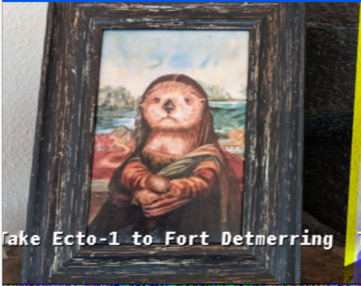

# Slow Scan TV (SSTV) Challenges

There was a set of ? SSTV challenges. Challenges use basically the same set techniques to solve.

- [Slow Scan TV (SSTV) Challenges](##-Slow-Scan-TV-(SSTV)-Challenges)
  - [Acquire](#acquire)
  - [Playback](#playback)
  - [Decode](#decode)
  - [Flags](#flags)
  - [References](#references)

## Acquire
See [Acquiring the signal](../Acquisition/README.md#Acquisition)

## Playback
See [Playback of signal](../Acquisition/README.md#Playback)

## Decode
Use QSSTV to decode to the images

## Flags
Once QSSTV is reading the signal, it's just a matter of waiting.

### SSTV 1

## References
https://ourcodeworld.com/articles/read/956/how-to-convert-decode-a-slow-scan-television-transmissions-sstv-audio-file-to-images-using-qsstv-in-ubuntu-18-04

