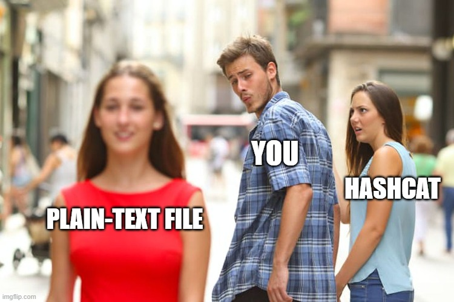

#  USB Drive
400

We found this USB drive in the parking lot of the attacker's building, it seems empty like they possibly reformatted it but we've uploaded the image for you to take a look at to see if you can get anything out of it.

We also analyzed a computer they had and found that it had WinRAR 5.91 installed we're guessing if they would've put something on it they would've compressed it using that.

[drive_image.rar](drive_image.rar)

# Flag
```
RTXFLAG{R3c0v3r3d_Th3_Fl4g}
```

# Solution
The archive contains an image file. In linux, you can mount the image - but, it's "empty". In Windows, it's corrupted. You can investigate the image using binwalk
```
$ binwalk drive_image.img 

DECIMAL       HEXADECIMAL     DESCRIPTION
--------------------------------------------------------------------------------
284160        0x45600         Zip archive data, encrypted at least v2.0 to extract, compressed size: 43, uncompressed size: 29, name: flag.txt
284257        0x45661         Zip archive data, encrypted at least v2.0 to extract, compressed size: 84202, uncompressed size: 84329, name: plain-text.jpg
368705        0x5A041         End of Zip archive, footer length: 22
369152        0x5A200         JPEG image data, JFIF standard 1.01
```

I used foremost to extract the zip and the jpg.
```
$ foremost drive_image.img 
Processing: drive_image.img
|foundat=flag.txt��b|̫��O�Kg���O������9�g����"�TC�����&�UP��>+
***|
```

The image is just an image - no stego or strings ... The archive is password-protected. Tried fcrackzip without luck. 


Was about to through brute-force at it, but teammate JoshL had an idea
```
... if I guess that the jpg we were given is the same jpg outside, in theory I should be able to the jpg file read as "text" as a plaintext for the attack
```

He found an article showing how this works on ZipCrypto [https://anter.dev/posts/plaintext-attack-zipcrypto/](https://anter.dev/posts/plaintext-attack-zipcrypto/).

We both started down this avenue. Idea is to use bkcrack the encrypted zip, the plain text file ans a smal portion of the plain text file to crack the archive. But - the archive is not ZipCrypto - couldn't get it to work at least.

Found another reference to this technique [https://www.elcomsoft.com/help/en/archpr/known_plaintext_attack_(zip).html](https://www.elcomsoft.com/help/en/archpr/known_plaintext_attack_(zip).html)

They even have software (trial version). So I switched over to a Windows VM and installed their stuff and got the flag.


# References
- [https://www.elcomsoft.com/archpr.html](https://www.elcomsoft.com/archpr.html)