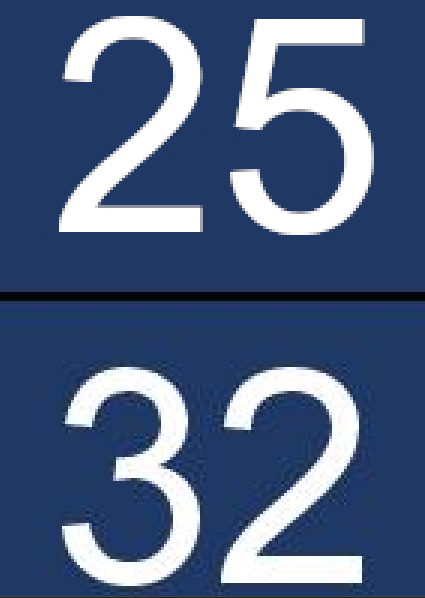
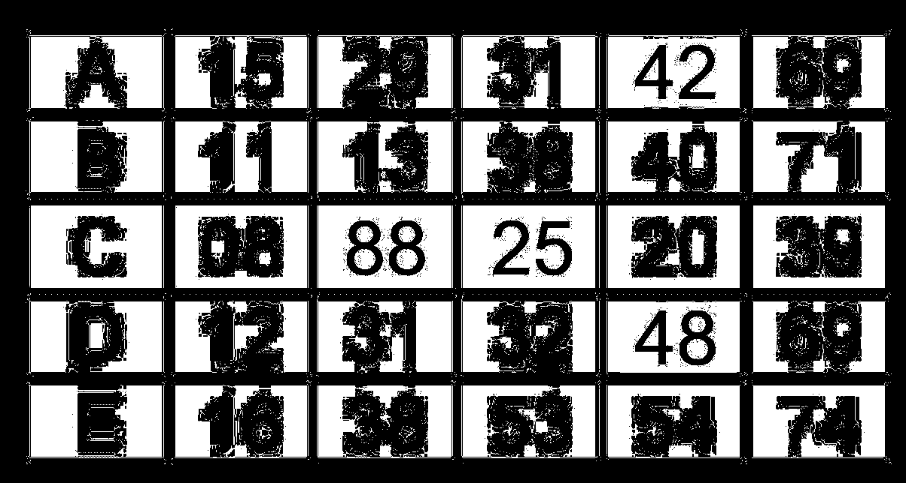

# Lottery ticket
10

Someone is trying to sell this lottery ticket online, it has the winning numbers but I suspect foul play

Can you tell me which the new numbers are that are photoshopped?

Add them all up, the resulting number is the flag


## Flag
```
203
```

## Solution
Download and inspect the image. On close inspection, some numbers look "distorted" and some look "crisp".



Using GIMPs thresholding tool shows some clear distiinctions



As the letters also have that blurring, I guessed that the crisp numbers were the photoshopped ones.