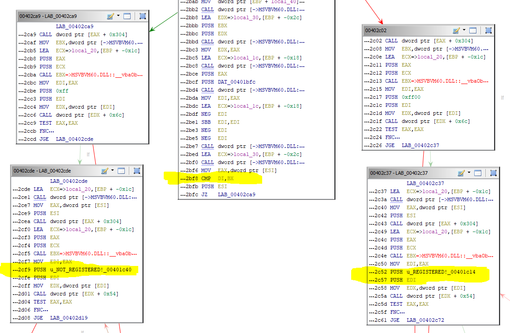
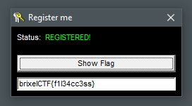

#  registerme.exe
15

This program needs to be activated

Can you figure out how to do it?

[registerme.exe](registerme.exe)

## Flag
```
brixelCTF{f1l34cc3ss}
```

## Solution

Download binary and evaluate. The form shows the "Not Registered" message. Open in Ghida. Find the strings "REGISTERED!" and trace back from there to find an exploitable branch. This happens at instruction 0x00402bf8. The compare, if 0, will jump to the not registered branch.



Using Ghidra, change the JZ instruction to a JNZ. Save the patched binary (File -> Export Program). Run the patched program.

