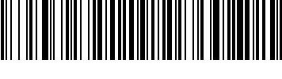
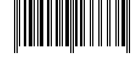
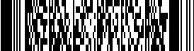

# Scan me
10 points

Can you solve this scan puzzle?

It could be handy to hide messages


## Flag:
```
brixelCTF{m4st3r_0f_sc4n5}
```

# Solution
Decoding the QR code provides a link to a website. Decoding can be done with many different applications. I used python library called pyzbar [https://pypi.org/project/pyzbar/](https://pypi.org/project/pyzbar/).
```python
import pyzbar.pyzbar as pyzbar
import cv2

# provided file
file = 'qr-code.png'
im = cv2.imread(file)

# Find barcodes and QR codes
decodedObjects = pyzbar.decode(im)
msg = ''
if decodedObjects != []:       
        msg = decodedObjects[0].data.decode()

print(msg)
```
The above code provided the following output
```
http://www.timesink.be/qrcode/flag.html
```

This website has another bar code,



Same bit of code works. This one decodes to ```code-128-easy```. Submitting this answer leads to another barcode.  




I wasn't sure how far this rabbit hole was going to go, so I continnued with pyhthon. I incorporated Selenium for python [https://pypi.org/project/selenium/](https://pypi.org/project/selenium/) and chromedriver [https://sites.google.com/a/chromium.org/chromedriver/](https://sites.google.com/a/chromium.org/chromedriver/) to handle the web automation of downloading the images adn submitting anwers.
```python
import pyzbar.pyzbar as pyzbar
import cv2
from selenium import webdriver
from time import sleep

# chrome Driver location
chromedriver = r'chromedriver.exe'

# provided file
file = 'qr-code.png'
im = cv2.imread(file)

# Find barcodes and QR codes
decodedObjects = pyzbar.decode(im)
msg = ''
if decodedObjects != []:       
        url = decodedObjects[0].data.decode()

print(url)

# website has a barcode, which when decoded, and output submitted takes you to 
# another page ... this prompted this route.
img_xpath = '/html/body/div/img'
txtbx_xpath = '/html/body/div/form/input[1]'
submit_xpath = '/html/body/div/form/input[2]'

driver = webdriver.Chrome(chromedriver)
driver.get(url)
sleep(1)    

count = 1
while True:
    file = 'barcode' + str(count) + '.png'
    try:
        driver.find_element_by_xpath(img_xpath).screenshot(file)
    except:
        break
     
    im = cv2.imread(file)
    # Find barcodes and QR codes
    decodedObjects = pyzbar.decode(im)
    msg = ''
    if decodedObjects != []:       
            msg = decodedObjects[0].data.decode()
    
    if msg == '':
        break # the last one is not decoded by this library - use another online app
        
    print(msg)
    
    driver.find_element_by_xpath(txtbx_xpath).send_keys(msg)
    driver.find_element_by_xpath(submit_xpath).click()
    sleep(1)
    count += 1
```

Unfortunatly, the last bar code, which is a PDF417, is not readable by the pyzbar library. 



I tried using a homebrew method I found on Github, but didn't work. Ended up just using an online service (with no API).
