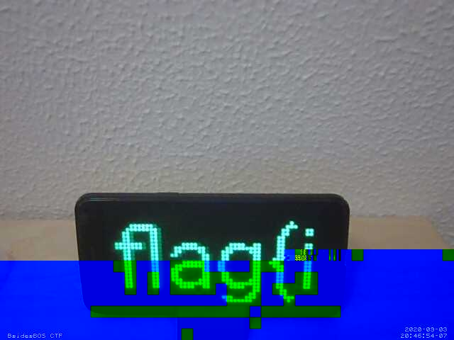

# Spy Cam

Oh no! I found some spyware on my laptop. Can you find out what the attacker saw?

Download the file below.

[see github for file]

# Flag
```shell
flag{i_spy_with_my_little_eye}
```

# Solution

Looking at pcap follow TCP conversation. Looks of images getting passed out. Too many to carve by hand. 

foremost for the win!
```shell
kali@kali:~/Desktop$ foremost capture.pcap 
Processing: capture.pcap
|*|
```

Output folder has sooo many images of a phone, with the flag scrolling across the screen.


