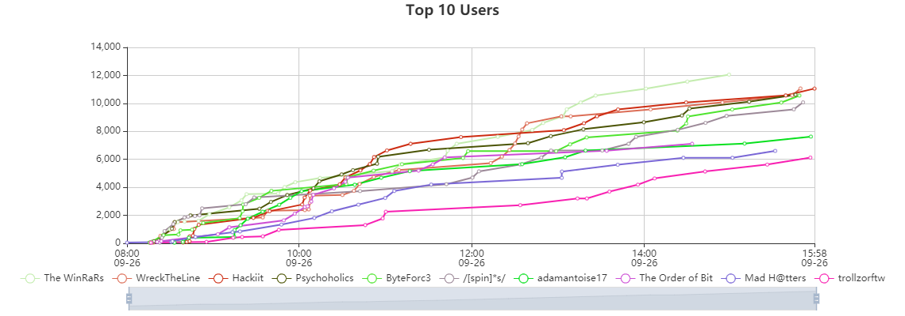

# BSidesBOS CTF 2020

[https://www.bsidesbos.org/](https://www.bsidesbos.org/)

A Capture the flag event or CTF is an event that can exercise many disciplines of information security: cryptography, stenography, binary analysis, reverse engineering, mobile security, web, forensics, network.... Challenges can vary but appeal to all skill levels.

BSides Boston CTF: [https://bsidesbos.ctf.games/](https://bsidesbos.ctf.games/). Please review all rules including prizing eligibility on this site. 

Check out John Hammond through these channels and start engaging with the CTF community!

YouTube: [https://www.youtube.com/johnhammond010](https://www.youtube.com/johnhammond010)

Discord: [https://discord.gg/UU3WQdf](https://discord.gg/UU3WQdf)

Twitter: [https://twitter.com/_johnhammond](https://twitter.com/_johnhammond) 

September 26th, 9:00 AM EST - 5:00 PM EST
8-Hour Competition

# Solves
Came in at 151st place with 1404 points.

| Challenge | Category | Value | Time | 
|---|---|---|---|
| [Read The Rules](Warmups/Rules/)     | Warmups        | 50  | September 26th, 10:26:25 AM |
| [Kiddie Pool](Warmups/Kiddie_Pool/)  | Warmups        | 50  | September 26th, 11:37:31 AM |
| [Baseball](Warmups/Baseball/)        | Warmups        | 50  | September 26th, 11:50:38 AM |
| [EZ Bake Oven](Warmups/EzBake/)      | Warmups        | 50  | September 26th, 12:36:13 PM |
| [Y2K](Warmups/Y2K/)                  | Warmups        | 300 | September 26th, 1:25:36 PM  |
| [Saving the World](Steganography/SaveTheWorld/)   | Steganography  | 445 | September 26th, 2:49:36 PM  |
| [Spy Cam](Forensics/Spy_Cam/)       | Forensics      | 459 | September 26th, 3:27:20 PM  |