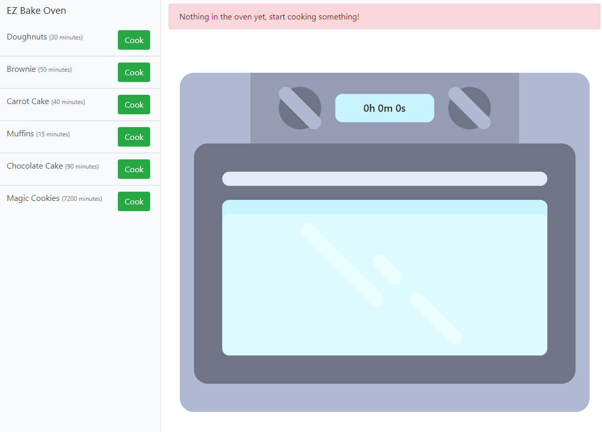

# EZ Bake Oven
288

Do you like baking? Don't leave the oven on for too long!

Open the Deployment tab to start this challenge.

# flag
```shell
flag{you_are_the_master_baker}
```

# Solution
Clicking on the deployment tab sets up a connection for us:

Challenge Started! Please wait a few seconds for this instance to finish deploying

Connection Method

http://challenge.ctf.games:32575/

Navigating to the given site presents us with:


Last option - magic cookies. Started baking. Timer has nearly 120 Hours.... that won't do. 

After messing around in the developer options on the browser, noticed that a cookie was set. base64 decoding shows that the time was set and each second the javascript checks the amount of time left. If we could change the cookie ...

Burp suite.
Navigate to the site and start baking. Intercept...
Reload the page as capture the cookie. base64 encode the string of your choice. in this case:
```shell
{"recipe": "Magic Cookies", "time": "09/21/2020, 17:23:29"}
```
Which is roughly 120 hours ago.  
submit the altered request and when the site reloads... success
