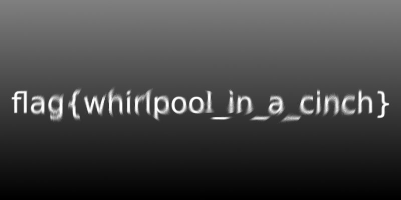

# Kiddie Pool
238

Look at this new graphic design technique I learned! This is like 900% cool!!!

Download the file below.

[kiddie_pool]

# flag
```shell
flag{whirlpool_in_a_cinch}
```

# Solution

In the News: In 2007 the police catched a pedophile men who tried to mask his identity with a swirl face. 


There are several programs that can do this, including photoshop. I do not have photoshop. After a bit of searching and a couple online programs that didn't work, and not luck with gimp, came across a python package call Wand.

 [https://docs.wand-py.org/en/0.6.3/](https://docs.wand-py.org/en/0.6.3/)

 Wrote a quick script and along with the hint "900%" quickly got that flag.



   