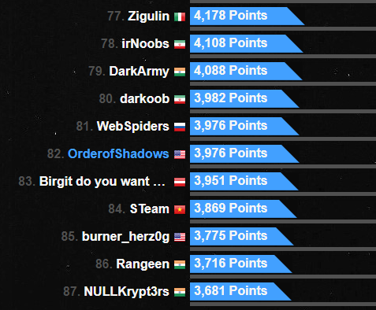
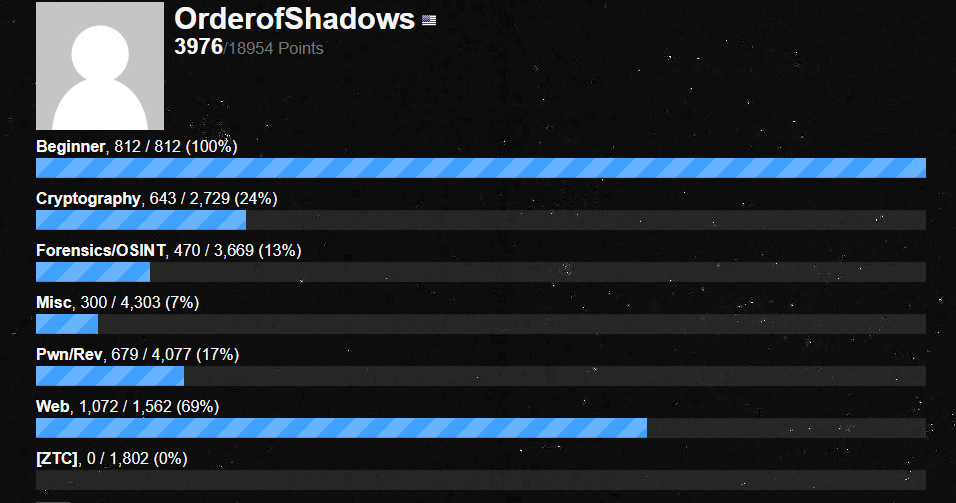

# rgbCTF 2020

## Thanks

## Challenge Listing
Challenges listed in order of solved, with final point values  and time (UTC) flag submitted shown.

- Beginner
    - [Simple RSA](Beginner/Simple_RSA/) - nice start to RSA challenges.
    - Pieces - Java src tracing, math (writeup incomplete)
    - [Quirky Resolution](Beginner/QR/) - stego, threshold image to get QR code
    - Name a more iconic band - Windows mem dump, SAM file password hash crack, some guessing (writeup incomplete)
- Crypto
    - [I Love Rainbows](Crypto/Rainbows/) - rainbow table hashes
    - [Occasionally Tested Protocol](Crypto/OTP/) - xor encryption, timed PRNG
    - [Shakespeare Play, Lost (and found!)](Crypto/Shake) - Ye 'ol school crypto
- Pwn/Rev
    - [Too Slow](Pwn_Rev/Too_Slow/) - dynamic analysis, cause jump to speed up execution
    - [Advanced Reversing Mechanics 1](Pwn_Rev/ARM1/) - static analysis, math
    - [Object Oriented Programming](Pwn_Rev/OOP/) - Java src tracing
- Misc
    - [Hallo?](Misc/Hallo/) - DTMF, T9 decoding
    - [Differences](Misc/Differences/) - Java src, fix code, fix - orig = flag
- Forensics
    - [PI 1: Magic in the air](Forensics/PI1) - Bluetooth keyboard packet capture

