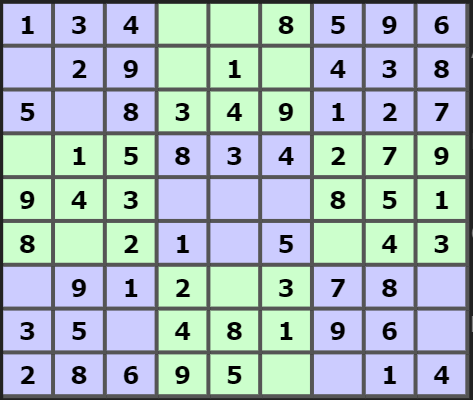

# Sudo what?
50 points

134|XX8|596X29|X1X|4385X8|349|127---|---|---X15|834|279943|XXX|8518X2|1X5|X43---|---|---X91|2X3|78X35X|481|96X286|95X|X14

## flag
```shell
ruffryders
```

## Solution
Karl had the bright idea on this one. After attempting the "Bathroom Code" (unfinished) and sudoku fresh on the brain, he was like "wait ... is that a play on words?". Figured I'd see if the numbers made a solvable puzzle. What do you know.

https://www.sudokuwiki.org/sudoku.htm



Some letter mapping later
```shell
134|XX8|596X29|X1X|4385X8|349|127|X15|834|279943|XXX|8518X2|1X5|X43|X91|2X3|78X35X|481|96X286|95X|X14
134 728 596729 516 438568 349 127 615 834 279943 672 851872 195 643 491 263 785357 481 962286 957 314
    72     7   5 6     6          6              672     7   9  6   4    6    5  7       2      7 3
	72 75 66 66 72 79 64 65 72 73
```

And quick to convert hex to ascii: 

https://gchq.github.io/CyberChef/#recipe=From_Hex('Auto')
