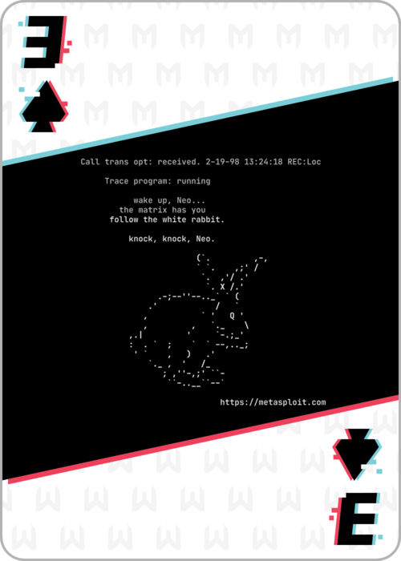

# 3 of Spades


Port 8080 has a login panel.  Looks like a timing based attack. We are given a good user name and asked to identify another good one. Trying a couple shows that "wrong" usernames take much less time to respond to, while good ones take over 5 seconds.

Found useername ```demo``` using guesing and using SecLists-master/Usernames/Honeypot-Captures/multiplesources-users-fabian-fingerle.de.txt for inspiration. Submit this to get the next link, which has the 3 of spades card.

## FLAG:
```
f712772216492c517a618ad7155f202e
```
