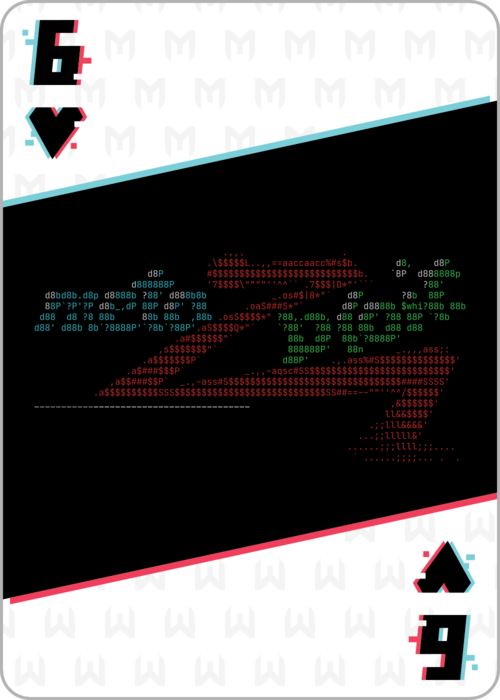

# 6 of Hearts


Hello port 6868. There is a user registration page. Registering as a user shows a directory for notes and ```/notes/[first initial][last initial]/[file ID]```.

From the front page we can guess that there are at least three users. Little bit of URL hacking:

* Barry deVillneuve
  * /notes/BD/0
    * Had a bagel today, it was pretty ok.
  * /notes/BD/1
    * Beth, the site admin, keeps hassling me about consenting to the site changes so she can improve security. I don't see the point tbh, site seems good as it is.
  * /notes/BD/2
    * ಠ_ಠ
* Tanya Wallace
  * /notes/TW/0
    * TODO:
      /* Get back to John of the "John likes music" band about shooting times
      /* Respond to Miss Yager's to confirm that I am ok with her site changes
      /* Buy another camera. You can never have too many.
  * /notes/TW/1
    * (╯ ͠° ͟ʖ ͡°)╯┻━┻  
  * /notes/TW/2
    * I swear if someone asks me to photograph something for free again I'm going to lose it.
* Malcom Cooper
  * /notes/MC/0
    * REMINDER!!! Pick up the replacement lens for the Nikon!
  * /notes/MC/1
    * ¯\_( ͡° ͜ʖ ͡°)_/¯
  * /notes/MC/2
    * Weirdest thing happened today. I was in the "Photos5u" main office and there was this woman, I think she was one of the techies, and she was ranting about "Eye Doors" or something to the owner. Apparently, our middle names are a threat to the site?!?!?  Honestly, with middle names like "Ulysses Denise Donnoly" you'd think she'd be happy about hers being in use. Actually now that I think about it, she's probably embaressed about her intials.   
  
The notes suggest that BUDDY is potential user, i.e. Beth Ulysses Denise Donnoly Yager. It is:
* Beth Ulysses Denise Donnoly Yager
  * /notes/BUDDY/0
    * 🂶
  * /notes/BUDDY/1
    * ლ(▀̿Ĺ̯▀̿ ̿ლ)
  * /notes/BUDDY/2
    * Close, but no cigar...

For the 6 of Hearts , neither the html page of the character md5sums are the flag...

Went back to the main page to look where the other images were being stored. Found 
```
http://172.15.41.117:6868/files/BUDDY/2
```

Which has the card.

## FLAG:
```
628fd217328ae42080d697a65a39d8e1
```