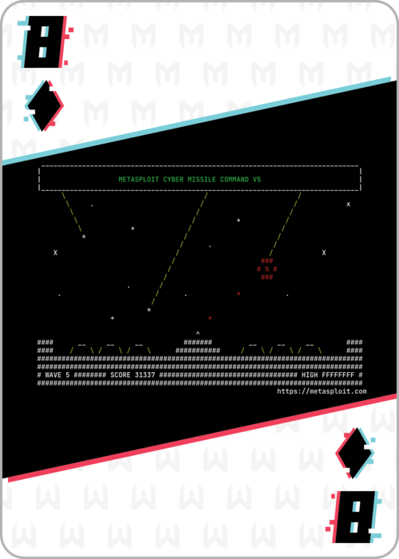

# 8 of Diamonds


Programming challenge. To say the least - I really liked this challenge. I want to recreate the game and add some additionally logic. Maybe make a more robust AI to solve different levels. Say tuned!

To start, you have to connect to the machine using a terminal session - not a webpage (Yah!)
```
nc 172.15.41.117 5555
```

Some sort of "dodgeball" kind of game. Took some time to figure out how to move. Then, at 400 pts, two hostiles began appearing and I needed to retool a bit for that logic. 

As the hostiles did not change their path once placed, I breifly considered coming up with a stack and planning several moves in advance. However, after running through a few of the more difficult cases (such as being at either the first or last position and having to move two spaces to get clear) I decided to just program the logic of "stay away from the walls" as those locations were prone to getting into a trap.
```python
import socket
import re

host='172.15.41.117'
port=5555

s = socket.socket(socket.AF_INET, socket.SOCK_STREAM)
s.connect((host, int(port)))
data = b'some data'

move_right = b'C\r\n'
move_left = b'D\r\n'

hostile_indx = [-33,-20]
player_indx = [-16, -3]

while len(data) > 1:
    data = s.recv(5000)
    print(data[6:].decode())
    hostile = data[hostile_indx[0]:hostile_indx[1]].decode()
    player = data[player_indx[0]:player_indx[1]].decode()
    pi = player.find('^')
    if '0' in hostile:
        # see if we need to dodge
        hi = [m.start() for m in re.finditer('0', hostile)]     
        if pi in hi:
            if pi < 12: 
                if pi+1 not in hi:
                    s.sendall(move_right)
                else:
                    s.sendall(move_left)
            else:
                s.sendall(move_left)
    # get away from the walls
    else:
        if pi == 0:
            s.sendall(move_right)
        if pi == 12:
            s.sendall(move_left)
```

Here is an example of the last move:
```
HSCORE: 489
|    0     0  |
|  0        0 |
|       00    |
|       0   0 |
|  0    0     |
|   0 0       |
|   0 0       |
|     0    0  |
|   00        |
| 0  0      ^ |

Check port 7878!
```

Checking this new port, we get the png and running md5sum we get our flag.

## FLAG:
```
8269da9d70f09eabf90d35059705fc06
```

