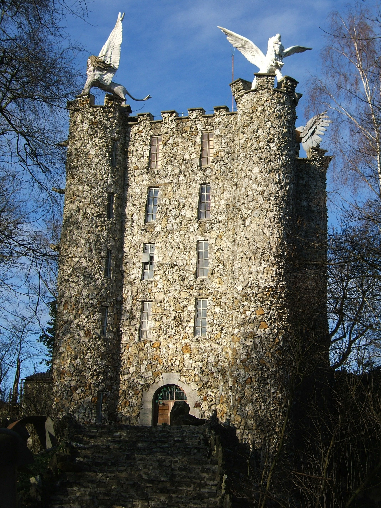

 # A quick search
5

Here's an easy one to start off the OSINT challenges.

I took this photo but forgot the name of this tower.

Can you give me the name?

I remember it started with an E.



## Flag:
```
Eben-Ezer
```

## Solution
Google Image Search leads to the Wikipedia page
[https://en.wikipedia.org/wiki/Eben-Ezer_Tower](https://en.wikipedia.org/wiki/Eben-Ezer_Tower)