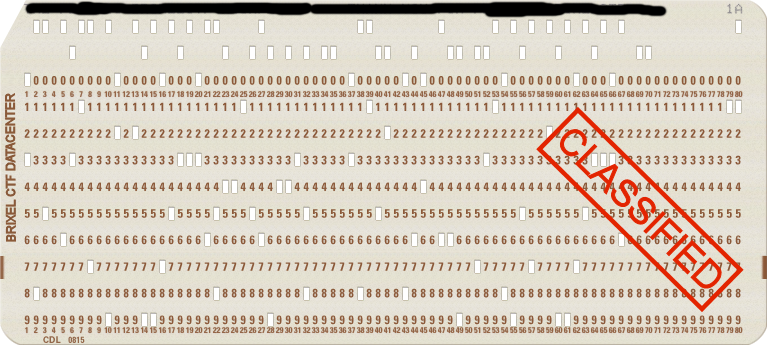

# punchcard
10

I found this old punchcard

it seems to be classified

can you figure out what's on there?



## Flag
```
BRIXELCTF(M41NFR4M3)
```

## Solution
Used [https://www.masswerk.at/keypunch/?home=1](https://www.masswerk.at/keypunch/?home=1)

They have a scanner feature.