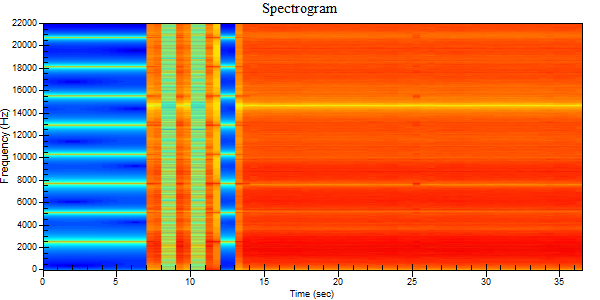
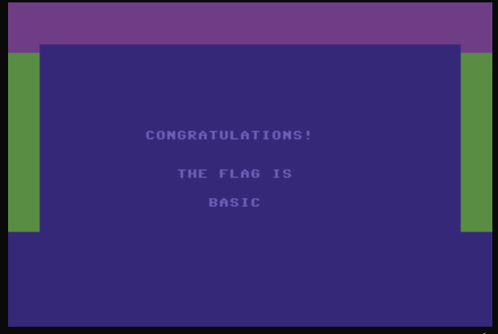

# The tape
20

I found this cassette tape from the '80s. I bet it has some cool games on it or something.

Better start looking for someone who grew up in that era... :)

This flag is not in the usual format, you can enter it with or without the brixelCTF{flag} format

## Flag
```
BASIC
```

## Solution
Download wav file. Assuming it was data, looked at time series and spectrogram. The time series shows square wave with varying frequency. The spectrogram shows the protocol and the carrier frequency at 2594 Hz.


After a bit of research, found this project:
[https://github.com/lunderhage/c64tapedecode](https://github.com/lunderhage/c64tapedecode)

Used it to create a TAP file and to try and decode:
```
wav2tap CTF-TAPe.wav | c64tapedecode -T -v
```

Output appears to be a BASIC program. Used [https://virtualconsoles.com/online-emulators/c64/](https://virtualconsoles.com/online-emulators/c64/) to run the program.


