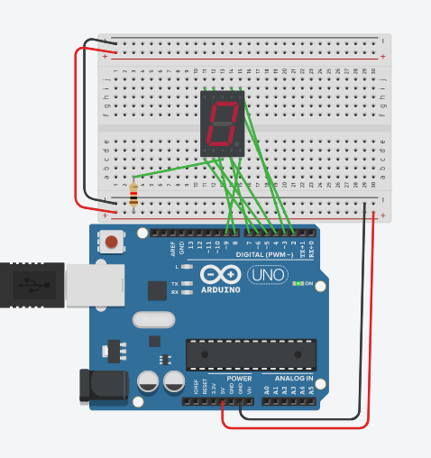

#  An arduino project
15

I once made this arduino program but forgot what it does.

Unfortunately I lost the schematic that comes with it.

Maybe you can get it running?

This flag is not in the usual format, you can enter it with or without the brixelCTF{flag} format

[arduino_project.ino](arduino_project.ino)

## Flag
```
406798190332
```

## Solution
While familiar enought with arduino to understand the code, I initially thought that the circuit called for LEDs on the eight pins. I thought that the lights would blink out some binary code that would translate to a flag. The values did not, however, translate to the standard set of ascii characters.

The thing that got me thinking was the labels (A,B,C,D,E,F,DP). Did a quick google search and found the wiki on 7-segment display.


Using TinkerCad Circuits [https://www.tinkercad.com](https://www.tinkercad.com) to set up a simulation and retrieved the flag.


