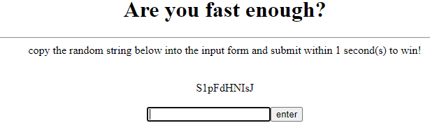
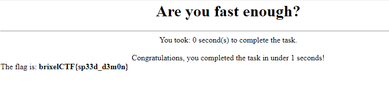

#  Are you fast enough?
10

Can you program something that is fast enough to submit the solution before the time runs out?
http://timesink.be/speedy 

## Flag
```
brixelCTF{sp33d_d3m0n}
```

## Solution

Navigate to the website. Challenge is to submit a string in under 1 second. 




Sounds like a job for Selenium [https://www.selenium.dev/](https://www.selenium.dev/) and Python. Selenium allows you to automate web browser interactions. Here I'm using the xpath of the elements (random string, input box and button clicking).

```python
from selenium import webdriver
from time import sleep

# path to driver
chromedriver = 'chromedriver.exe'

# url to visit
url = 'http://timesink.be/speedy/'

# xpath of elements to interact with
rndStr_xpath = r'//*[@id="rndstring"]'
input_xpath = r'//*[@id="inputfield"]'
submit_xpath = r'//*[@id="submitbutton"]'

# start the driver
driver = webdriver.Chrome(chromedriver)

# visit the page
driver.get(url)

# get the string
rndstr = driver.find_element_by_xpath(rndStr_xpath).text

# input string into input box
driver.find_element_by_xpath(input_xpath).send_keys(rndstr)

# click enter
driver.find_element_by_xpath(submit_xpath).click()
```

